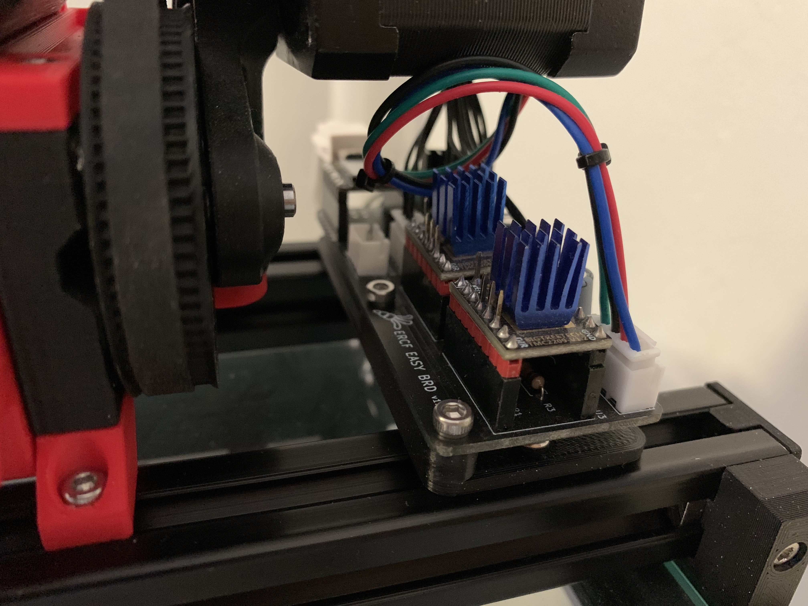
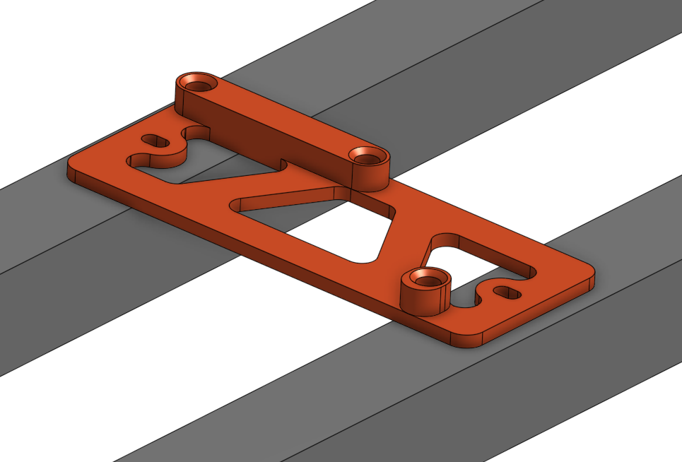

# ERCF EASY BRD MOD : Top rail mount
Author: NyxCode
- [x] Tested

Mounting plate for bolting the PCB to the top of two 2020 extrusions.

## BOM
- 2 M3x6 BHCS
- 2 M3 T-nuts
- 3 Heatset inserts
- 3 M3x6 BHCS/SHCS

## Instructions
1. Insert the heatset inserts into the printed mounting plate
2. Bolt the mounting plate to the two 2020 extrusions using the two **M3x6 BHCS** and the two **T-nuts**
3. Secure the PCB to the mounting plate using the three **M3x6**
